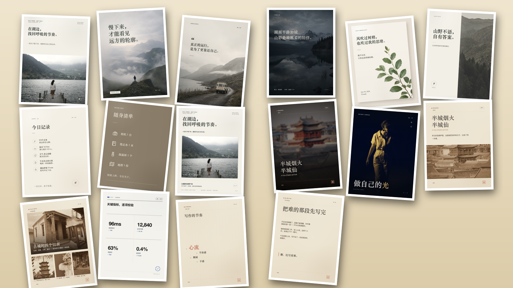
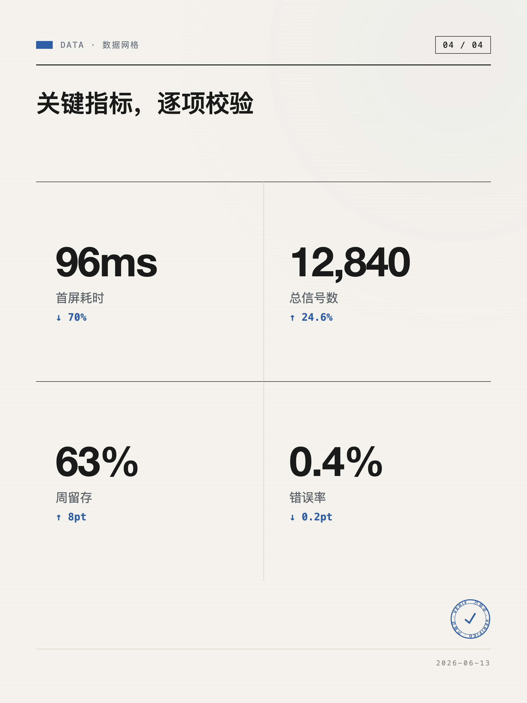

# BLCaptain Style Skill

**中文** · [English](README.en.md)

> 把一段内容，变成第一眼就想点进去、一眼能认出是「你」的小红书 / 公众号图文卡片。



[](LICENSE)  

> **安装**：对你的 Agent（Codex / Claude Code / Cursor / Gemini CLI…）说 ——「帮我安装这个 Skill：`github.com/dososo/blcaptain-style-skill`」

---

## 为什么要做它

刷小红书、看公众号，那些第一眼就想点进去的封面——大留白、好字体、有质感的图——和 AI 随手生成的「大色块 + emoji + 紫色渐变」卡片，差的不是一星半点。

问题出在哪？**大多数 AI 工具做的是网页，不是杂志。** 而图文卡片的本质，和海报、画报、专辑封面是同一种东西：用一张静态图，在 1 秒钟里让人停下来。杂志和海报，已经把这件事研究了一百年。

BLCaptain 把这一百年的排版功夫，变成 AI 能稳定复用的能力——**你丢一段内容进去，它替你想好版式、配好图、排好字，产出能直接发的图文卡片组。**

底气是：好看不是玄学，是可以拆解、可以写进代码的常识。字号差多少、留白留多少、什么颜色不能用、文字怎么压在图上不挡脸——这些全被固化成了**常量**。AI 不自由发挥，只在被验证过的版式里填内容，所以出来的图稳定地好看。这些常量，才是真正抄不走的护城河。

## 它能给你什么（效果）

| 维度 | 内容 |
|---|---|
| **版式** | 3 套视觉语言 / 8 种封面母体 / 14 种正文骨架，每种还有构图重心 · 纸色 · 装置三轴变体 |
| **主题** | 11 套经过验证的主题色板（不让你乱填 hex，乱填只会变丑） |
| **图源** | 接 12 个公开图库、4 档版权分级，**国内 CC0 源前置、开箱即用不翻墙** |
| **独家风格** | 三套独家影像配方（暖墨 / 电蓝三调 / 电影色调 + 散焦氛围），同一张真实图变成「只有我们能出的样子」 |
| **平台** | 小红书 3:4 / 公众号封面 / X 5:2 / 方形卡，一份内容同时出多画幅 |

## 独家风格与优势

别的 AI 卡片工具大多是「一套模板套所有内容」，结果满屏一个味。我们不一样：

1. **3 套视觉语言，各有灵魂**——不是换色皮肤，是给每份内容认领一个立场（手记 / 证据 / 连接）。
2. **独家 duotone / haze 影像配方**——这是和「干净配图」拉开差距的命门：同一张照片，过我们一道，就成了一眼可辨、抄不走、不撞通用 stock 的影像。
3. **证据方法论叙事**（实证语言）——VERIFIED 印章 + 真实截图标注 + 流程证据链，让读者「相信流程」，不只是「看到漂亮数据」。
4. **国内开箱即用**——CC0 图源国内站点前置，不依赖 VPN。
5. **常量护城河**——字阶 / 留白 / 对比阈值 / 断行规则全是代码常量，稳定地好看、稳定地是「我们」。

## 三套视觉语言

选语言不是挑装饰，是给这份内容认领一个立场：

### 静纸 · Still Paper（纸）
把内容沉淀成有温度的纸本手记。暖纸 + 衬线大字 + 朱砂 + 大留白 + 手作痕迹。
**8 封面母体**（满铺压图 / 质感照片 / 留白井 / 标题文字版 / 引言压图 / 物件特写 / 数字索引…）+ **14 正文骨架**（随笔 / 清单 / 图集 / 边注时间轴 / 手绘路线图 / 引言 / 账目 / 矩阵 / 对照 / 流程 / 核心词…）。

### 实证 · Signal Proof（证据）
把内容校验成可信的证据——**界面是证据层，读者才相信流程**。奶白档案纸 + 电蓝 + VERIFIED 印章。
**3 种封面形态**（纯文字主张 / 趋势数据 / 真截图）+ **7 种证据卡**（截图舞台 / 洞察 / 数据 / 工作流 / 双栏对照 / 田野笔记 / 测评评分）。

### 图桥 · Bridge Canvas（连接）
把内容连接成跨平台、跨场景的统一表达。电影感满铺强图 + 黑边。
**5 种版式**（满铺 / 图叙事 / 黑卡巨字 / 上下分割 / 标题穿插主体），一张图同时出 3:4 / 1:1 / 16:9。

## 主题色（11 套，不让你乱填 hex）

给无限的颜色选择，更容易做出难看的东西；给 11 套被验证过的色板，做出能看的概率接近 100%。

- **静纸 5 套**：`SP-01 雾野` · `SP-02 暖书房` · `SP-03 海岸` · `SP-04 夜纹` · `SP-05 炉台`（暖纸底 + 朱砂点睛 + 栗褐安静衬 + 暖墨立骨，色彩有固定角色，错位即廉价）。
- **实证 5 套**：`SL-01 电蓝`（奶白 `#F7F6F2` + 电蓝 `#2F5EA7`）· `SL-02 石墨薄荷` · `SL-03 安全珊瑚` · `SL-04 酸性青柠` · `SL-05 信号黑`。
- **图桥**：`BC-01` cinematic 暖金 + 墨蓝 split-tone。

## 样例（资产库一览）

封面来自资产库各主题、三套语言。更多见 [`docs/gallery/`](docs/gallery/)：

<p>



</p>

## 适合 / 不适合

**适合**：读书笔记 · 旅行探店 · 生活随笔 · 情感叙事 · AI 工具教程 · Agent 流程 · 截图证据卡 · 数据复盘 · 工具对比 · 职场框架 · 公众号封面 · 小红书竖版知识卡。

**不适合**（会直说、劝你换工具）：追星应援 · 纯促销硬广 · 超过 12 屏的长教程 · 纯修图磨皮换脸 · 没有结构目标的氛围图 · 无来源记录的图片搬运。**一个什么都能做的工具，通常什么都做不好。**

## 品类适配（内容 → 语言 / 版式）

| 内容品类 | 语言 | 典型版式 |
|---|---|---|
| 旅行 / 探店 / 城市指南 | 静纸 | 质感封面 + 图集 + 手绘路线图 + 边注一天 |
| 生活 / 随笔 / 个人观察 | 静纸 | 标题 / 引言封面 + 随笔 + 引言 |
| 读书笔记 / 文化 | 静纸 | 引言封面 + 随笔 + 核心词 |
| 物件 / 自然现场 | 静纸 | 物件特写 + 图集 |
| AI 工具 / 产品教程 | 实证 | 主张 / 截图封面 + 截图舞台 + 工作流 |
| 数据复盘 / 对比决策 | 实证 | 趋势封面 + 数据卡 + 双栏对照 |
| 职场干货 / 方法框架 | 实证 | 主张封面 + 洞察 + 田野笔记 |
| 跨平台 / 产品总览 | 图桥 | 满铺 / 黑卡 + 多画幅同源 |

## 使用场景（任务 → 怎么做）

| 你想做 | 这样说 |
|---|---|
| 把一篇文章做成小红书组图 | 「用 BLCaptain 把这段内容做成小红书图文：…」 |
| 给 AI 工具教程配截图证据卡 | 「这是我的工具教程截图，做成实证风格的证据卡」 |
| 一份内容发小红书 + 公众号 | 「再出一版公众号封面 / 方形卡」 |
| 觉得不好看要改 | 直接说「换封面 / 字大点 / 这张图太暗 / 这页太空」 |

## 哪些 Agent 能用

不绑定某一个 Agent。**只要你的 Agent 支持 Skill（能读取本地 Skill 文件夹），就能用：**

| Agent | 支持方式 |
|---|---|
| Codex / OpenAI Agent Skills | 直接安装 |
| Claude Code | 插件市场或本地 |
| Cursor / Gemini CLI / Copilot | 兼容 |
| 其他支持 Skill 的 Agent | 通用方式 |

> 出图需要本地能跑 Node（渲染用 Playwright）。Agent 能调用命令行就能完整出图。

## 安装

```bash
# 通用方式（推荐）
npx skills add dososo/blcaptain-style-skill -g

# 或手动：克隆到你 Agent 的 skills 目录
git clone https://github.com/dososo/blcaptain-style-skill.git
# Codex：cp -R blcaptain-style-skill ~/.codex/skills/

# 首次出图前装一次渲染依赖
npm install && npx playwright install chromium
```

环境要求：Node ≥ 20。

## 怎么用

装好后，在新会话里说人话：

```
用 BLCaptain 把这段内容做成小红书图文：
（把你的文章 / 笔记 / 产品介绍贴进来）
```

它会读懂内容、挑一套视觉语言、需要配图时问你「用自己的图、还是从免费图库找」，然后排版、出图。不满意直接说「换个封面 / 字再大点」，它会改。想批量出图、控制每一步，也有命令行（`build → render`），见 [SKILL.md](SKILL.md)。

## 工作流：五动作出图法

一条顺下来的创作主线，不是填格子，每个动作都由 Agent 亲自经手：

1. **读懂** — 读出核心主张、关键点、可上图的视觉碎片；摸清平台比例、内容类别、你有没有图、必留的硬约束。
2. **定调** — 按内容形态认领一套视觉语言 + 一个主题。
3. **分页** — 收束成骨架：定张数、给每页一个唯一任务、挑真金句、相邻页不落同一版式。
4. **落版** — 每页定封面母体 / 正文骨架 + 变体；要图时备好图（影像优先，主图当第一眼主角 + 套独家调色）。
5. **成图** — 亲手写结构化 `brief.json`，交确定性引擎渲染成 PNG。

最后一道**把关**：机器门禁（结构没坏）→ 人工眼（最终闸门）→ 不满意回炉。

## 验证效果

**技术 PASS ≠ 视觉 PASS。** 机器只证明结构没坏，审美由人确认：

- **机器门禁**（`npm run test:gates`）：文字不溢出 / 不碰撞、留白不塌空、截图大到能读、360px 缩略图仍可读、卡面无内部代号泄漏、三套语言渲染契约。
- **人工 UAT**：成图交你做人工视觉确认——这才是最终发布闸门。
- **回炉**：不满意就按反馈迭代文案 / 裁切 / 版式 / 主题 / 图。机器测量、审美靠人；先出图、再迭代。

## 设计原则

这些是它「替你避开会变丑的坑」的底线——负面边界，才是真正的专家经验：

- **做的是杂志、不是网页**：第一眼要有冲击（标题够大 ≥3:1 反差、留白够多 ≥40%），不做平淡的网页味卡片。
- **反 AI 感**：不用紫蓝橙粉渐变、不居中对称、不全圆角浮卡、不堆 emoji、留手作痕迹、用文化来源色。
- **配色克制**：单一强调色只占 ~5%、不多色打架；不用纯白纯黑（用暖白 / 近黑）；主题色是系统合同、不让乱填 hex。
- **影像优先**：能配图就让图当第一眼主角，套独家调色；AI 生图只兜底、带风格约束。真实照片 / 截图永远优先。
- **图不毁**：不拉伸截图、不让文字压住人脸 / 产品 / 食物主体 / 关键 UI。
- **诚实中性**：不编造品牌 / 来源；外部图记录真实来源；卡面不印内部代号 / demo 假信息。
- **只学不抄**：研究优秀项目的方法，但设计 / 配色 / 版式 / 资产全部原创——做出来像任何现成模板，就是不合格。

## 视觉审美参考

这套审美不是凭空来的，对标的是被时间验证过的标杆（只学机制、不抄作品）：

- **杂志排版**：The New Yorker · Kinfolk · Cereal · Monocle · The Gentlewoman 的留白、字阶、不对称张力。
- **编辑 / 海报获奖**：SPD（出版设计协会）· D&AD · TDC 的 feature opener 与尺度反差。
- **摄影构图光影**：Magnum · National Geographic · World Press Photo 的构图法则、光影、景别、photo-essay 编排。
- **当代趋势**：散焦氛围底、出血巨字、重音排版、单色相极简——2026 设计共识里「极致、纯净、一眼吸睛、抗 AI 感」的手法。

## 目录结构

```
blcaptain-style-skill/
├── SKILL.md            # 给 Agent 读的大脑：智能驱动工作流 + 五动作 + 铁律
├── PRODUCT.md          # 产品定位 / 护城河 / 能力边界
├── bin/                # CLI 入口（plan / build / render / image-fetch）
├── src/                # 引擎：版式渲染 / 设计系统 CSS / 内容→brief / 校验
├── references/         # 按需加载：图源工作流 / 内容规划 / 身份自检 / 最佳实践
├── examples/           # brief.json 格式范例
└── docs/gallery/       # 成图样例
```

## 后续计划（Roadmap）

- 更多品类的真实内容打磨（影视 / 家居 / 美食 …）。
- 真实地理瓦片地图（补现有手绘路线图，国内可用前提下）。
- 更多主题色板与封面母体。
- 双语文档持续完善，覆盖更多 Agent 平台的安装方式。

## FAQ

**Q：和那些「一键生成卡片」的工具有什么不一样？**
A：它们大多一套模板套所有内容，一眼能看出是 AI。我们是 3 套有灵魂的视觉语言 + 独家影像配方 + 替你排除会变丑的选项，出来一眼是「你」，不撞大众。

**Q：必须用 Claude 吗？**
A：不必。只要你的 Agent 支持 Skill（Codex / Claude Code / Cursor / Gemini CLI…），就能用。

**Q：没有图怎么办？**
A：优先用你自己的照片 / 截图；没有就从免费图库（国内 CC0 源前置）找，会记录来源；都没有才克制地用 AI 生图。

**Q：能改颜色 / 字体吗？**
A：主题色是验证过的系统色板、不让乱填 hex（乱填只会变丑）；但版式、主题、封面、文字大小都能在对话里调。

**Q：能发公众号 / X 吗？**
A：能。一份内容可同时出小红书 3:4 / 公众号封面 / X 5:2 / 方形卡。

**Q：出来不好看怎么办？**
A：直接说「换封面 / 字大点 / 这图太暗 / 这页太空」，它会改。机器只保证结构没坏，好不好看你说了算。

## 关于作者

**爆裂队长NEXT**

15yr PM. Fired myself. Hired 10 AIs. Turns out managing AIs is harder than managing humans.

AI Agents BLTeam 翻车笔记。真实战，生产级真干货持续分享。少刷二手情绪，多看一手信号源。

- X / Twitter：[@thinkszyg](https://x.com/thinkszyg)
- 邮箱：blteam2026@outlook.com

欢迎在 [Issues](https://github.com/dososo/blcaptain-style-skill/issues) 提反馈、提需求。

## License

**开源与个人用途免费；闭源商业用途需购买商业授权。** 详见 [LICENSE](LICENSE)。

## 致谢

- 渲染基于 [Playwright](https://playwright.dev)。
- 设计上研究并借鉴了业界优秀社交卡片项目的产品化思路——但**只学方法、不抄设计**，三套视觉语言都是自己原创的审美。
